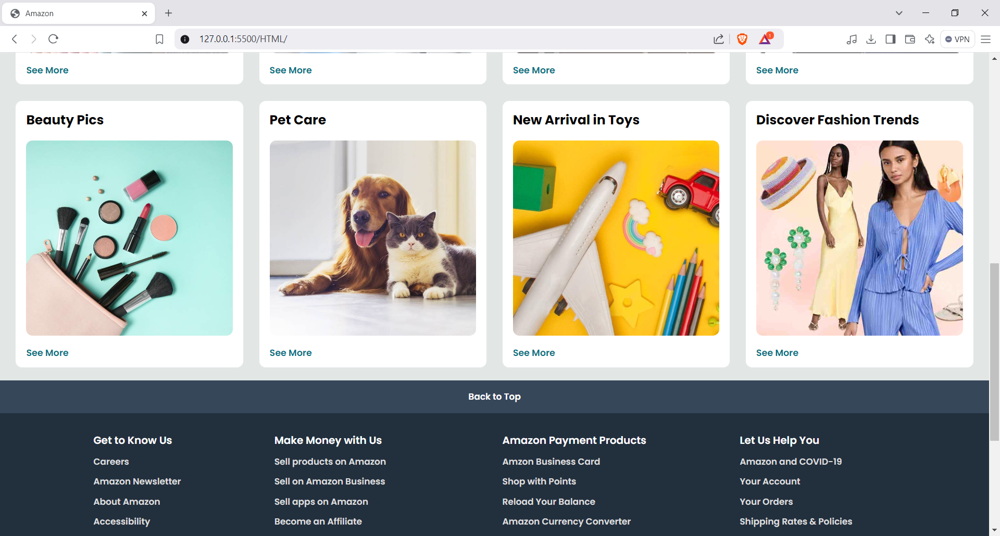

# Amazon Clone Project

This project is a basic Amazon clone that replicates the look and feel of the Amazon homepage.

## Project Structure

```
├── CSS
│   └── style.css
├── HTML
│   └── index.html
├── Images
│   ├── amazon_logo.png
│   ├── box1_image.jpg
│   ├── box2_image.jpg
│   ├── box3_image.jpg
│   ├── box4_image.jpg
│   ├── box5_image.jpg
│   ├── box6_image.jpg
│   ├── box7_image.jpg
│   ├── box8_image.jpg
│   └── hero_image.jpg
└── photo
    ├── win1.PNG
    └── win2.PNG
```

## Technologies Used

- **HTML**: For the basic structure of the webpage.
- **CSS**: For styling and layout.

## Features

- Amazon-like homepage layout.
- Responsive design.
- Product grid display with images.

## How to Run the Project

1. Clone the repository:

```bash
git clone https://github.com/Aman-pr/Amazon-clone.git
```

2. Navigate to the project directory:

```bash
cd amazon-clone
```

3. Open the `index.html` file in your browser.

## Folder Structure

- **CSS**: Contains the main stylesheet (`style.css`).
- **HTML**: Contains the main HTML file (`index.html`).
- **Images**: Contains all the product images and the Amazon logo.
- **photo**: Contains additional screenshots (`win1.PNG`, `win2.PNG`).

## Screenshots

### Homepage


### Product Grid



## Future Enhancements

- Adding JavaScript for interactivity.
- Implementing backend for cart functionality.

## Contributing

Contributions are welcome! Feel free to fork the repo and submit a pull request.

## License

This project is licensed under the MIT License.
